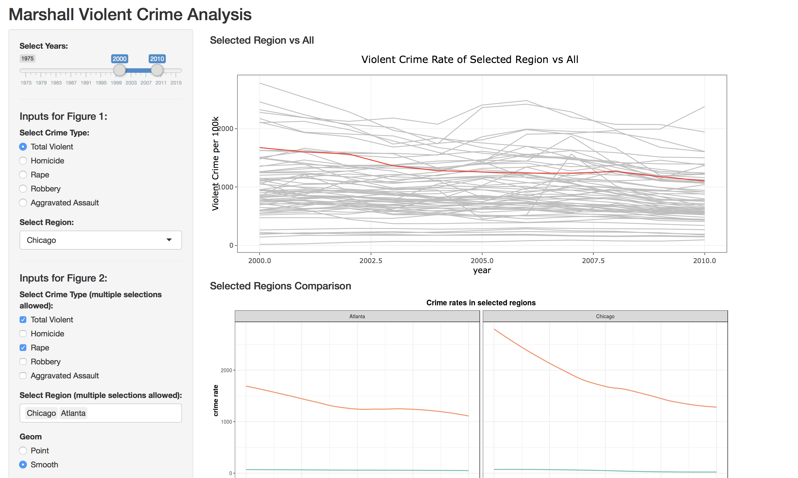
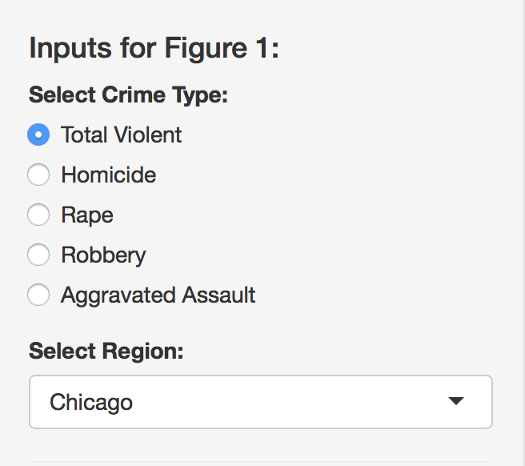
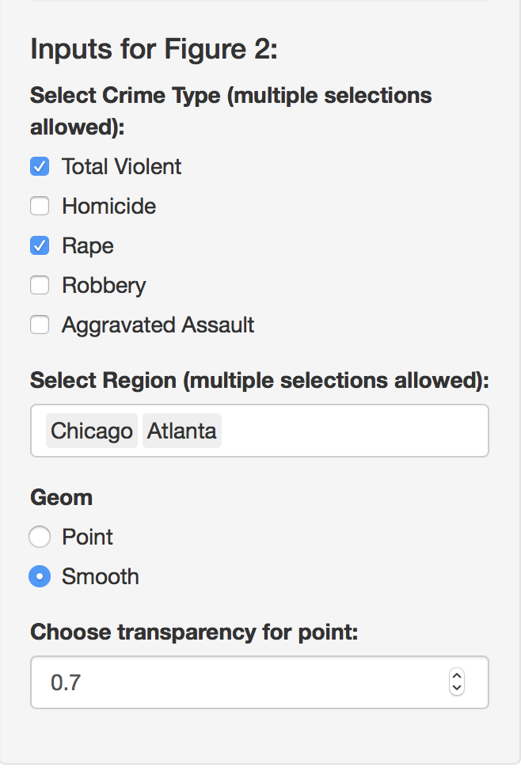
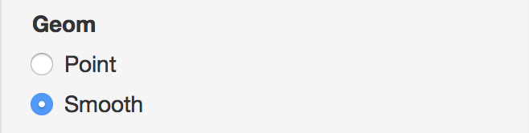
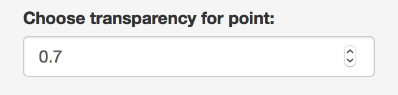
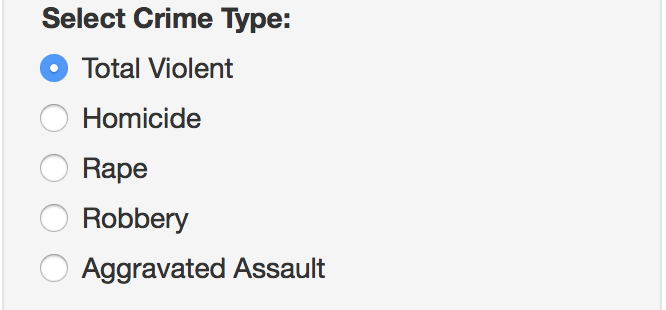
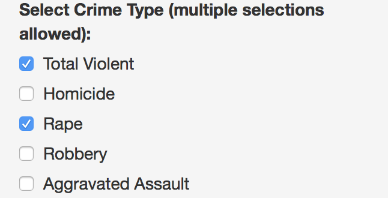
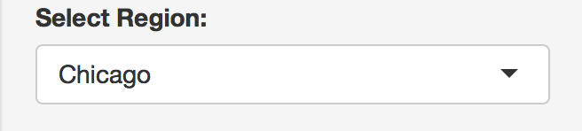
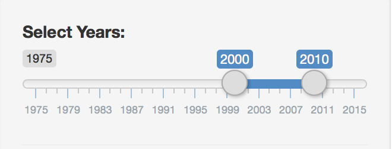

# Sophiashinyapp

## Overview

Whether the crime in the US is increasing or decreasing and which regions have more crimes have been hot topics for long. To answer these questions, I propose setting up a data  visualization app that enables people who are interested to explore the dataset of Marshall Violent Crime and visualize the results. My app will display the distributions of total crimes and different crime types in terms of years and regions in order to get the trend of crimes and compare crimes in different places within the US. 

## Description of the data

The dataset my app is based upon was collected by the Marshall Project. The dataset contains data on the four major crimes classified as violent by the FBI — homicide, rape, robbery and assault — in 68 police jurisdictions from years 1975 through 2015. Besides, the total violent crimes and crime rates ("violent_per_100k", "homs_per_100k", "rape_per_100k", "rob_per_100k", "agg_ass_per_100k") are demonstrated in the dataset.

##Description on the app

### The app

[xiaosophiameng.shinyapps.io/sophia_crimeDate_shinyapp](https://xiaosophiameng.shinyapps.io/sophia_crimeDate_shinyapp/)

### Summary of my app

My app enables users to access, analyze and visualize the Marshall Violent Crime Data. Uers are allowed to modify several aspects (details as below) of the visualiztion to serve their particular interests. The visualiztion figures on the app display information according to the users' selections. 

##### User Input

Changing visual encoding:

-   plot type: point or smooth line
-   point transparency: from 0 to 1

Filtering data:

-   by crime type
-   by region
-   by year range

### Screenshots showing the functions of my app

#### What my app looks like?

#### Inputs for the first figure

#### Inputs for the second figure

#### Changing visual encoding

-   plot type: point or smooth line 

	

-   point transparency: users could select based on their habits or pereference

	

#### Filtering data

-   by crime type: users could select one type of crime 

	

-   by crime type: users could select to view all violent crimes and/or particular crime types (multiple selections allowed) 

	

-   by region: users could choose one region they are most intereted in (one selection per time only)

	

-   by region: users could choose multiple regions they are intereted in to do the comparison (multiple selections allowed) 

	

-   by year range: users could choose a year range they  particularly care about

	
